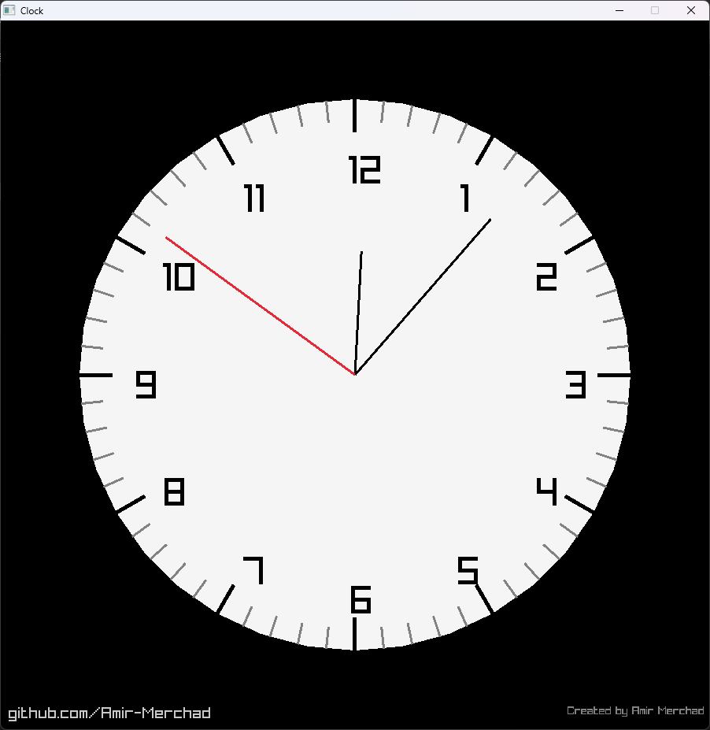

# 🕰️ Raylib Analog Clock

A real-time analog clock built in **C** using the **raylib** graphics
library.\
This project demonstrates procedural 2D rendering, trigonometric
calculations, system time integration, and basic audio playback in a
native environment.

------------------------------------------------------------------------

## 📸 Preview



> Replace `screenshots/demo.png` with an actual screenshot or GIF of
> your running clock.

------------------------------------------------------------------------

## 🚀 Features

-   **Real-time synchronization** using `time.h` and `struct tm`
-   **Procedural rendering** of clock face, tick marks, and numbers
-   **Accurate trigonometric calculations** for hand positioning
-   **Synchronized ticking sound** (plays once per second)
-   **Interactive GitHub link** inside the application
-   **Native Windows GUI build** (no console window)

------------------------------------------------------------------------

## 🛠️ Tech Stack

-   **Language:** C (C11)
-   **Library:** raylib 5.x
-   **Build System:** CMake (3.21+)
-   **Compiler:** MinGW-w64 (x86_64)

------------------------------------------------------------------------

## 🧮 How It Works

### 1️⃣ Angle Calculation

Each hand is converted from time units into radians.

``` c
// -PI/2 shifts 0 radians to 12 o'clock
float secondAngle = local->tm_sec * (2 * PI / 60) - PI / 2;
```

### 2️⃣ Polar → Cartesian Conversion

To draw lines from the center of the clock:

    x = centerX + radius * cos(theta)
    y = centerY + radius * sin(theta)

This is used for: - Hour markers - Clock hands - Number placement

------------------------------------------------------------------------

## 🔊 Audio System

-   `InitAudioDevice()` initializes raylib audio
-   `LoadSound()` loads the tick sample once
-   Sound plays only when `tm_sec` changes
-   `UnloadSound()` properly frees memory on exit

------------------------------------------------------------------------

## 📦 Build Instructions

### 🔧 Requirements

-   MinGW-w64 (64-bit)
-   CMake ≥ 3.21
-   raylib MinGW 64-bit build

### 📁 Raylib Setup

Download raylib from:

https://github.com/raysan5/raylib/releases

Extract to:

    C:/raylib

Expected structure:

    C:/raylib
    ├── include
    └── lib

------------------------------------------------------------------------

### 🏗️ Build

``` bash
git clone https://github.com/Amir-Merchad/raylib-analog-clock.git
cd raylib-analog-clock

mkdir build
cd build

cmake ..
cmake --build . --config Release
```

------------------------------------------------------------------------

## 📂 Project Structure

    .
    ├── main.c
    ├── CMakeLists.txt
    ├── resources/
    │   └── clock_tick.wav
    ├── screenshots/
    │   └── demo.png
    └── README.md

------------------------------------------------------------------------

## 📦 Distribution

If statically linked:

    Clock.exe
    resources/

If dynamically linked:

    Clock.exe
    raylib.dll
    resources/

------------------------------------------------------------------------

## 🔮 Future Improvements

-   Dark / Light mode toggle
-   Smooth sweeping second hand
-   Adjustable tick volume
-   Timezone selection
-   Cross-platform support (Linux/macOS)

------------------------------------------------------------------------

## 👨‍💻 Author

**Amir Merchad**\
Computer Science Student

GitHub: https://github.com/Amir-Merchad

------------------------------------------------------------------------

## 📜 License

This project is licensed under the MIT License.
